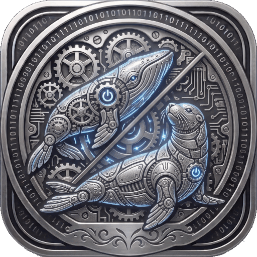

<div align="center">
  

  # Alloy
  *A full-featured Docker management dashboard*

  [](https://www.rust-lang.org)
  [](https://github.com/tokio-rs/axum)
  [](https://react.dev)
  [](https://www.typescriptlang.org)
  [](https://mantine.dev)
  [](https://docs.docker.com/engine/api/)
  [](https://podman.io)
  [](LICENSE)
  [](#testing)

  ⭐ If you find this useful, consider starring the repo!

  [Features](#features) • [Quick start](#quick-start) • [Configuration](#configuration) • [API](#api) • [Deployment](#deployment) • [Development](#development)

</div>

**Alloy** is a real-time Docker management dashboard with a Rust/Axum backend and a React/TypeScript frontend. Monitor, manage, and automate your containers through a clean web interface — with live container state via SSE, automatic updates, configurable alerts, scheduled tasks, and OIDC authentication.

> [!NOTE]
> Alloy connects to the Docker daemon via the local socket (or Podman socket). No database required — state is persisted to JSON files.

## Features

<details open>
<summary><strong>🐳 Container Management</strong></summary>

- **Real-time monitoring** — Live container list with status, image, size, and uptime via SSE
- **Lifecycle control** — Start, stop, restart, and remove containers from the dashboard
- **Detailed inspection** — Full container metadata, mounts, networks, ports, and environment
- **Traefik integration** — Quick links to Traefik-managed containers
- **Search & filter** — Filter by name, image, state, or stack

</details>

<details>
<summary><strong>📦 Stack & System Management</strong></summary>

- **Docker Compose stacks** — Auto-discover and manage compose projects (pull + recreate)
- **System pruning** — Prune containers, images, networks, and volumes
- **Batch operations** — Start/stop/restart all containers in a stack

</details>

<details>
<summary><strong>🔄 Automated Updates</strong></summary>

- **One-click updates** — Pull latest image and restart any container
- **Bulk check & update** — Check all containers against registry, then update selected
- **Update policies** — Per-container policy (none, pull, pull+restart, pull+restart+stack)
- **Auto-update worker** — Optional background daemon that checks the registry periodically
- **Scheduled update checks** — Cron-based registry checks with notification support
- **Update history** — Full audit trail with timestamps and digests

</details>

<details>
<summary><strong>🔔 Alerts & Scheduling</strong></summary>

- **Container state alerts** — Monitor running→exited transitions and recovery
- **Scheduled tasks** — Cron-based container actions (start, stop, restart, update)
- **Notifications** — Telegram, Matrix, and Webhook support
- **SSE notifications** — Real-time notification stream in the dashboard

</details>

<details>
<summary><strong>🔐 Authentication</strong></summary>

- **OIDC authentication** — Full OpenID Connect discovery flow (PocketID, Authentik, Keycloak, Google, etc.)
- **JWKS validation** — PocketID-style token validation via `{issuer}/.well-known/jwks.json`
- **Session management** — Cookie-based sessions (httponly, signed)
- **Flexible auth** — Cookie, Bearer header, or query parameter (for SSE)

</details>

## Architecture

```
┌──────────────────────────────────────────────────┐
│                   Browser                         │
│           React + Mantine UI                      │
│           SSE streams / REST calls                │
└──────────────────────┬───────────────────────────┘
                       │ HTTP / SSE
┌──────────────────────▼───────────────────────────┐
│              Rust / Axum Backend                   │
│                                                    │
│  ┌─────────┐  ┌──────────┐  ┌──────────────────┐  │
│  │ Routes  │  │ Workers  │  │  Broadcast Channels│ │
│  │ REST    │  │ state    │  │  /events          │  │
│  │ SSE     │  │ auto-upd │  │  /updates         │  │
│  │ Auth    │  │ alerts   │  │  /notifications   │  │
│  └────┬────┘  │ schedule │  └──────────────────┘  │
│       │       └────┬─────┘                        │
│       └──────┬──────┘                             │
│              │  Bollard (Docker API)               │
└──────────────┼────────────────────────────────────┘
               │ unix socket
┌──────────────▼────────────────────────────────────┐
│              Docker / Podman Daemon                 │
│         (containers, images, volumes, networks)     │
└───────────────────────────────────────────────────┘
```

The backend is organized into **13 modules** (~4,235 lines):

| Module | Lines | Responsibility |
|---|---|---|
| `workers.rs` | 756 | Background workers: state, auto-update, alerts, scheduler |
| `updates/` (3 files) | 588 | Image pull, update, digest compare, version check, history |
| `auth.rs` | 480 | OIDC auth code flow, session middleware, SPA fallback |
| `containers.rs` | 410 | Container CRUD, inspect, fetch, pull |
| `models.rs` | 402 | Data types, constants, AppError |
| `stacks.rs` | 374 | Docker Compose stack management |
| `config.rs` | 338 | Config (YAML + env vars + Podman secrets) |
| `main.rs` | 289 | Entry point, startup, workers, router |
| `state.rs` | 216 | AppState, JwtValidator, OidcMetadata |
| `persistence.rs` | 153 | JSON load/save helpers |
| `notifications.rs` | 135 | Telegram & Matrix dispatchers |
| `admin.rs` | 96 | Admin handlers (alerts, settings) |
| `events.rs` | 62 | SSE event stream handler |

### Background Workers

| Worker | Interval | Purpose |
|---|---|---|
| `state_worker` | Docker Events API + fallback 30s | Listens for Docker events, refreshes container list |
| `auto_update_worker` | Configurable (default 6h) | Pull + restart containers with auto-update enabled |
| `alerts_worker` | 30s | Monitors container state transitions |
| `scheduler_worker` | 60s | Evaluates cron expressions, executes scheduled actions |
| `oidc_states_cleanup` | 5 min | Cleans expired OIDC CSRF states (>10 min) |

### Update Flow (`check-all` → policy apply → restart)

The bulk update flow (`POST /api/check-all`) is a two-phase process:

**Phase 1 — Check (blocking, returns response):**

```
Frontend                        Backend
   │                               │
   ├── POST /api/check-all ────────┤
   │                               ├── fetch_containers()
   │                               ├── for each container (parallel):
   │                               │     ├── parse_image_ref(image) → (repo, tag)
   │                               │     ├── check_remote_digest(repo, tag) → Docker Hub
   │                               │     │     ├── GET auth.docker.io/token (Bearer token)
   │                               │     │     ├── GET registry-1.docker.io/v2/{repo}/manifests/{tag}
   │                               │     │     └── extract config.digest from manifest
   │                               │     └── compare short_digest(local) vs short_digest(remote)
   │                               ├── persist has_update to SQLite
   │                               ├── build pending list (containers with has_update)
   │                               ├── tokio::spawn(apply_policies_background) ────┐
   │                               └── return Json(containers) with has_update ✔────┤
   │                                                                                │
   ├── receives response ──────────┤                                                │
   │   updates container list      │                                                │
   │   if has_update > 0:          │                                                │
   │     shows progress bar ───────┼── SSE /api/updates ◄───────────────────────────┘
   │                               │     (update-progress events)
```

**Phase 2 — Policy apply (background, non-blocking):**

```
Backend (tokio::spawn)
   │
   ├── for each pending container:
   │     ├── resolve policy (per-container or default)
   │     │
   │     ├── [PullRestart] ──────────────────────────────────┐
   │     │     ├── tag_backup_image()  (if rollback enabled) │
   │     │     ├── pull_image() → docker.create_image()      │
   │     │     ├── restart_container() → docker.restart()    │
   │     │     ├── verify_container_healthy() (if rollback)  │
   │     │     │     ├── OK → continue                       │
   │     │     │     └── FAIL → rollback_container()         │
   │     │     └── cleanup_old_image() (if configured)       │
   │     │                                                   │
   │     ├── [PullRestartStack] ─────────────────────────────┤
   │     │     ├── resolve_compose_file() → docker labels    │
   │     │     ├── docker compose -f <file> pull             │
   │     │     └── docker compose -f <file> up -d            │
   │     │                                                   │
   │     └── [Pull] → pull_image() only                 ◄───┘
   │
   ├── SSE update-progress (done, status)
   ├── SSE notification (updated ✅)
   ├── notify_all() → Telegram / Matrix / Webhook
   ├── persist has_update = false to SQLite
   └── append to UpdateHistoryEntry (SQLite)
```

**Single container update** (`POST /api/update/{name}`) follows the same pull + restart logic synchronously, returning the result directly.

**Auto-update worker** (`auto_update_worker` in `workers/auto_update.rs`) runs periodically (default 6h) and applies the same digest comparison + pull + restart cycle to all running containers, with a final `docker.prune_images()` to clean up unused images.

**Key files:** `backend/src/updates/handlers.rs` (check_all_h, update_container_h, apply_policies_background), `backend/src/updates/digest.rs` (check_remote_digest, parse_image_ref, short_digest), `backend/src/workers/auto_update.rs` (auto_update_worker, rollback_container, verify_container_healthy), `frontend/src/components/DashboardPage.tsx` (checkAll, SSE progress tracking, summary dialog).

## Quick start

### Prerequisites

- [Rust](https://www.rust-lang.org) 1.81+ (for backend development)
- [Node.js](https://nodejs.org) 20+ (for frontend development)
- Docker Engine or Podman running locally
- [Just](https://github.com/casey/just) command runner (optional)

### Using pre-built Docker image

```sh
# Pull and run
podman run -d \
  --name alloy \
  -p 3066:3066 \
  -v /var/run/docker.sock:/var/run/docker.sock \
  -e OIDC_ISSUER_URL=https://your-oidc-provider.example.com \
  -e OIDC_CLIENT_ID=alloy \
  -e OIDC_CLIENT_SECRET=your-secret \
  -e OIDC_REDIRECT_URL=https://alloy.example.com/api/auth/callback \
  ghcr.io/atareao/alloy:latest
```

> [!IMPORTANT]
> Alloy **requires OIDC** authentication. There is no simple JWT fallback. You must configure `OIDC_ISSUER_URL`, `OIDC_CLIENT_ID`, `OIDC_CLIENT_SECRET`, and `OIDC_REDIRECT_URL`.

### From source

```sh
# Clone and enter project
cd /data/rust/alloy

# Build the Docker image
just build

# Or build manually (requires Rust + Node.js)
cd backend && cargo build --release
cd frontend && npm install && npm run build
```

## Configuration

Alloy is configured via a YAML file or environment variables.

### Minimal configuration

```yaml
# config.yaml
port: 3066
oidc_issuer_url: "https://your-oidc-provider.example.com"
oidc_client_id: "alloy"
oidc_client_secret: "your-secret"
oidc_redirect_url: "https://alloy.example.com/api/auth/callback"
```

### Environment variables

| Variable | Default | Required | Description |
|---|---|---|---|
| `PORT` | `3066` | No | Server listening port |
| `HOST` | `0.0.0.0` | No | Bind address |
| `OIDC_ISSUER_URL` | — | **Yes** | OIDC provider discovery URL |
| `OIDC_CLIENT_ID` | — | **Yes** | OIDC client ID |
| `OIDC_CLIENT_SECRET` | — | **Yes** | OIDC client secret |
| `OIDC_REDIRECT_URL` | — | **Yes** | OIDC callback URL |

## API

Alloy exposes a REST + SSE API at `http://localhost:3066/api/`.

### Authentication (OIDC)

| Method | Endpoint | Description |
|---|---|---|
| `GET` | `/api/auth/login` | OIDC login redirect |
| `GET` | `/api/auth/callback` | OIDC callback (code→token exchange) |
| `GET` | `/api/auth/me` | Session info (sub, name, email) |
| `GET` | `/api/auth/logout` | Logout (clear session) |

### Containers

| Method | Endpoint | Description |
|---|---|---|
| `GET` | `/api/containers` | List all containers |
| `GET` | `/api/containers/{name}/inspect` | Container details |
| `POST` | `/api/containers/{name}/start` | Start a container |
| `POST` | `/api/containers/{name}/stop` | Stop a container |
| `POST` | `/api/containers/{name}/restart` | Restart a container |
| `POST` | `/api/containers/{name}/remove` | Remove a container |

### Real-time streams (SSE)

| Endpoint | Payload |
|---|---|
| `/api/events` | Container state changes (Docker events) |
| `/api/updates` | Update progress per container |
| `/api/notifications` | Alert and notification events |

### Updates

| Method | Endpoint | Description |
|---|---|---|
| `POST` | `/api/update/{name}` | Pull + restart a single container |
| `POST` | `/api/update-all` | Pull + restart all containers |
| `POST` | `/api/check-update/{name}` | Compare local vs registry image |

### Stacks

| Method | Endpoint | Description |
|---|---|---|
| `GET` | `/api/stacks` | List compose projects |
| `POST` | `/api/stacks/{project}/update` | Pull + recreate stack services |

### Admin

| Method | Endpoint | Description |
|---|---|---|
| `GET/POST/DELETE` | `/api/admin/alerts` | Container state alerts |
| `GET/PUT` | `/api/admin/settings` | Dynamic settings (notifications, auto-update) |
| `GET/DELETE` | `/api/history` | Update history |
| `GET/POST/DELETE` | `/api/schedule` | Cron-based scheduled tasks |
| `GET` | `/api/config` | Public configuration (no secrets) |
| `GET` | `/api/health` | Health check (Docker ping) |

## Deployment

### With Quadlet (Podman systemd service)

Alloy ships with a ready-to-use Quadlet file for running as a systemd user service:

```sh
# 1. Copy the Quadlet
cp alloy.container ~/.config/containers/systemd/

# 2. Create data directory for persistent state
mkdir -p ~/.local/share/alloy/data

# 3. Reload and start
systemctl --user daemon-reload
systemctl --user start alloy

# 4. Enable at boot
systemctl --user enable alloy

# 5. View logs
journalctl --user -u alloy -f
```

The Quadlet automatically handles:
- Docker socket mounting (switch to Podman socket by uncommenting `DOCKER_HOST`)
- Persistent JSON storage (alerts, history, schedules, settings)
- Optional custom config via `~/.config/alloy/config.yaml`
- Restart on failure

> [!WARNING]
> Alloy requires OIDC configuration. Set the `OIDC_*` environment variables before exposing Alloy to a network.

### Build and push custom image

```sh
just build   # Build with current version tag
just push    # Push to registry
just upgrade # Bump version, update deps, tag, build & push
```

## Development

### Prerequisites

- Rust 1.81+
- Node.js 20+
- Docker Engine or Podman
- Just (optional, for project recipes)

### Workflow

```sh
# Just recipes
just list       # List available commands
just check      # Pre-commit: fmt + clippy
just lint       # cargo clippy --all-targets --all-features
just fmt        # cargo fmt -- --check
just fmt-fix    # cargo fmt

# Manual dev workflow
cd backend && cargo run     # Run with local config.yaml
cd frontend && npm run dev  # Vite dev server (hot reload)

# Build frontend for production
cd frontend && npm run build
```

### Testing

```sh
# Backend (44 tests)
cd backend && cargo test

# Frontend (18 tests)
cd frontend && npx vitest run
```

### Project structure

```
/
├── backend/
│   ├── Cargo.toml          # Rust dependencies
│   ├── config.yaml         # Runtime configuration
│   └── src/
│       ├── main.rs          # Entry point, router, workers
│       ├── admin.rs         # Admin handlers
│       ├── auth.rs          # OIDC auth flow
│       ├── config.rs        # Config loading
│       ├── containers.rs    # Container CRUD
│       ├── events.rs        # SSE handlers
│       ├── models.rs        # Types & errors
│       ├── notifications.rs # Telegram/Matrix
│       ├── persistence.rs   # JSON helpers
│       ├── stacks.rs        # Compose stacks
│       ├── state.rs         # AppState, JwtValidator
│       ├── updates.rs       # Image updates
│       └── workers.rs       # Background workers
├── frontend/
│   ├── src/
│   │   ├── App.tsx          # Shell, tabs, SSE
│   │   ├── types.ts         # TypeScript interfaces
│   │   ├── HistoryPage.tsx
│   │   ├── AlertsPage.tsx
│   │   ├── SchedulePage.tsx
│   │   ├── components/
│   │   │   ├── DashboardPage.tsx
│   │   │   ├── ConfigPage.tsx
│   │   │   ├── LoginScreen.tsx
│   │   │   ├── PolicyActionButton.tsx
│   │   │   ├── ErrorBoundary.tsx
│   │   │   └── NotifToast.tsx
│   │   └── api.ts           # API helpers
│   └── dist/                # Pre-built assets
├── data/                    # JSON persistence (runtime)
├── Dockerfile               # Multi-stage build
├── .justfile                # Task runner
└── AGENTS.md                # Agent documentation
```

### Adding features

- **New route** → Add handler in the corresponding module + `.route()` in `main.rs`
- **New worker** → Create async fn in `workers.rs` + `tokio::spawn()` in `main()`
- **New config** → Add field to `Config` + load logic + env override
- **New persistent state** → `Arc<Mutex<Vec<T>>>` in `AppState` + `load_json`/`json_writer`
- **New SSE event** → Struct + `broadcast::Sender` in `AppState` + SSE route
- **New module** → `mod name;` in `main.rs` + file `backend/src/name.rs`

### Tech stack

| Layer | Technology |
|---|---|
| **Backend** | Rust, Axum 0.8, Tokio (full), Bollard 0.18 |
| **Frontend** | React 18, TypeScript, Vite, Mantine UI 7 |
| **Real-time** | Server-Sent Events via `tokio::broadcast` + `tokio-stream` |
| **Auth** | OIDC only (JWKS validation, PocketID-style) |
| **Persistence** | JSON files (no database) |
| **Notifications** | Telegram Bot API, Matrix Client-Server API |
| **Deployment** | Podman, Quadlet, Docker |
| **Linting** | `cargo clippy` + `cargo fmt` |

---

<div align="center">
  <sub>Built with Rust + React. Powered by Docker API.</sub>
</div>